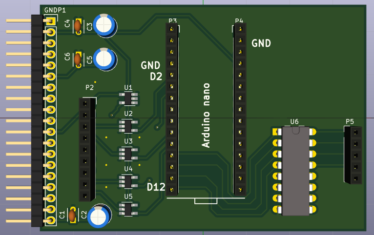
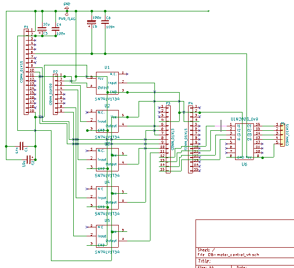
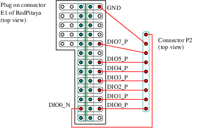

# Daughter_board

## Name
[`DB-motor_control_unborn`]()

## Title
Daughter board motor control made for unborn0x9 project

## Author
* [`CTC-dubois_jerome`](), Future Baby Production

## Date
February 2020

## Interfaces
### Input
* [`ITF-A_gnd`]()
* [`ITF-B_5v`]()
* [`ITF-F_12v`]()
* [`ITF-S_3_3v`]()

### Output
* [`ITF-A_gnd`]()
* [`ITF-I_pulse_on`]()
* [`ITF-J_pulse_off`]()
* [`ITF-K_pulse_redpitaya`]()

##External connections
### Input
* GPIO DIO7_N of RedPitaya (connector E1) on P2
* GPIO DIO5_N of RedPitaya (connector E1) on P2
* GPIO DIO4_N of RedPitaya (connector E1) on P2
* GPIO DIO3_N of RedPitaya (connector E1) on P2
* GPIO DIO2_N of RedPitaya (connector E1) on P2
* GPIO DIO1_N of RedPitaya (connector E1) on P2
* GPIO DIO0_N of RedPitaya (connector E1) on P2
* GPIO DIO0_P of RedPitaya (connector E1) on P2

### Output
* stepper A1 on P5
* stepper A2 on P5
* stepper B1 on P5
* stepper B2 on P5
* 12 V on P5

## Scheme

## Remarks
[BOM](./src/DB-motor_control_v3.csv)

### Motor
This daughter board is for driving [28BYJ-48-12V](https://letmeknow.fr/shop/fr/moteurs-et-servo-moteurs/1520-petit-moteur-pas-a-pas-avec-reducteur-28byj-48-12v-700465391773.html) unipolar stepper motor with an ULN2003 driver. We have change from bipolar to unipolar stepper motor, because old driver hash the 12V and produced a lot of noise. This motor has 32 step per tour with a 1/16 reductor so we have 512 step per tour wiich give an angular precision good enougth for the image. Moreover with the ULN2003 we can drive the motor without hash. So if we don't moove the motor during measuring acoustic line, it won't generate noise on signal. An arduino is pluged on socket P3 and P4 and the stepper motor is plugged on socket P5.

### RedPitaya connector
Socket P2 is used to connect the RedPitaya with this daughter_board such on following image.

The piece on the left of the image can be cut from a matrix board like for the mother board, the soldering track are on the top of this piece. There are two sockets 1*13 solder on it, don't forget to cut the tracks between these two socket (cut represent by the green line).

Some SN74 are used as level shifter for communication between RedPitaya (3.3 V) and arduino (5 V), such as:

* RedPitaya DIO0_N -> arduino D8
* RedPitaya DIO1_N -> arduino D3
* RedPitaya DIO5_N -> arduino D7
* RedPitaya DIO7_N -> arduino D2
* arduino D4 -> RedPitaya DIO0_P 

The GPIO DIO7_N is used to tell the arduino to make the excitation pulse.

When the arduino excite the transducer, it also send a trigger on GPIO DIO0_P to launch the digitization in the RedPitaya (interruption pin of the arduino).

The GPIO DIO1_N is used to tell to the arduino to rotate the motor of one step (interruption pin of the arduino).

The GPIO DIO5_N is used to tell in wich direction the arduino must rotate the motor.

The GPIO DIO0_N is used to enable/disable motor rotation. If true, the arduino execute the step order, overwhise it not and it stop powering the motor.  

The GPIOs DIO2_N, DIO3_N, DIO4_N are not used in this version of the motor board.

### Arduino

Usage of arduino GPIO:

* D1: NC
* D2, input: interruption to make the excitation pulse
* D3, input: interruption to make a step
* D4, output: trigger for RedPitaya digitization
* D5, output: analog pulse command
* D6, output: not use but connect to pulse_off track of mother board
* D7, input: rotation sens of the motor
* D8, input: enable motor
* D9, output: connect to IN1 pin of ULN2003
* D10, output: connect to IN2 pin of ULN2003
* D11, output: connect to IN3 pin of ULN2003
* D12, output: connect to IN4 pin of ULN2003
* D13: NC

## Results

## Pros/Cons/Constraint:

**Pros:** NA

**Cons:** NA

**Constraint:** NA
