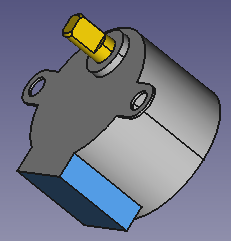
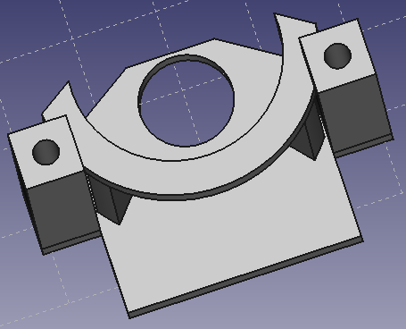
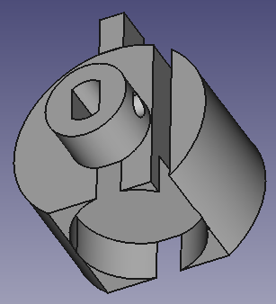
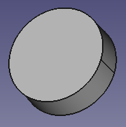
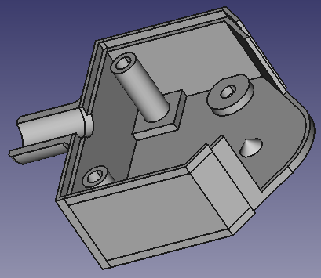

# Introduction

In this folder with have the source of the design of the probe made with freecad v0.18. This design is made for 28BYJ-48 motors, there are mechanical stops on both side to avoid the motor to go far. There a place to glue an acoustic window on the front of the probe. There is a kind of bottle cap to allow to fill the probe with an idoine fluide.

# Parts

## Motor

The motor use for this version is a [28BYJ-48-12V](https://letmeknow.fr/shop/fr/moteurs-et-servo-moteurs/1520-petit-moteur-pas-a-pas-avec-reducteur-28byj-48-12v-700465391773.html) unipolar motor :

follow the informations on link above, this motor can reach a speed 80 rpm (at 12 V), and have 513 step per tour considering the reduction factor.

So depending on the angle of the sweeping angle:

* 60° -> 8 images per second at maximum
* 90° -> 5.33 images per second at maximum

## Motor support

The motor support is shown on following image (bottom view):

motor is fixed on top of this piece (we don't see the holes to screw it). The two colomns are here to attach the motor support to the casing with screw and are long enougth to place the transducer support. One can see the mechanical stops just near the colomns, they are designed to allow a sweeping angle up to 90°, the over part of the mechanical stop is on the transducer support. The arc is here to avoid the transducer wire to be pinch in the mechanical stop.

## Transducer support

The transducer support is showned on following image (top/front view):

the top hole is design to plug the motor axis inside and there is a hole to put a screw to clamp it if necessary.

The over part of the mechanical stop is place on the back (top of the image). The transducer will be placed in cylindrical blind hole, and the "drain" is here for the cable of the transducer (not center in the face of the transducer).

## Transducer

This image is for information only, the transducer size is:

* external diameter: 15 mm,
* width: 5mm.

## Bottom housing

The bottom housing is shown in following image (top/front view):

